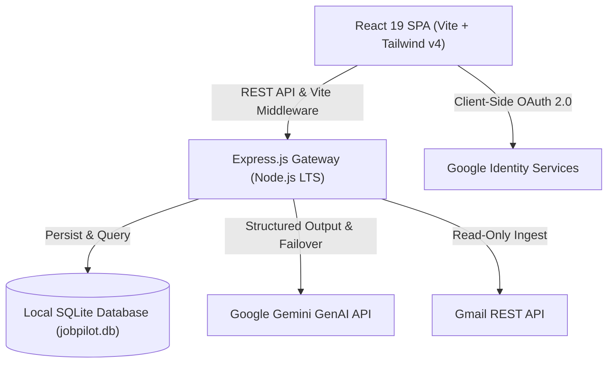

# JobPilot AI — Autonomous Career Copilot & Job Application Gateway

<div align="center">
  
  
  
  
  
</div>

---

## Executive Summary

**JobPilot AI** is an intelligent, privacy-first career accelerator and application gateway. It enables engineers and professionals to discover high-match opportunities, analyze job descriptions with sub-second AI latency, generate mathematically-bounded **1-page ATS-tailored resumes**, synthesize guardrailed application Q&A, and ingest job alerts directly from Gmail inboxes into a local, persisted SQLite database.

---

## Key Features

- 🎯 **AI Job Match & Scoring Engine**: Weighted multi-factor scoring (technical skills, cloud experience, CI/CD, seniority, and certifications) backed by Google Gemini with deterministic fallback heuristics.
- 📄 **Guaranteed 1-Page ATS Resume Generator**: Generates high-impact, ATS-optimized PDF and print-ready resumes mathematically calibrated to fit strictly on a single A4 page without spillover.
- ⚡ **Workspace with Dynamic Queue Navigation**:
  - Seamless **Previous / Next Job** buttons with live queue position counters.
  - **Unapplied Only** filter toggle.
  - **Dynamic Reordering**: Unapplied jobs stay prioritized at the top; marking a job as `APPLIED` automatically drops it down to the bottom.
  - One-click **"Mark Applied & Next"** workflow accelerator.
- 📬 **Gmail Job Alerts Reader**: Client-side OAuth 2.0 integration (Google Identity Services) with customizable scan ranges and a built-in zero-setup **Test Range Simulation** mode.
- 🔒 **Local SQLite Persistence (`data/jobpilot.db`)**: Master profiles, job pipelines, Gmail sync history, uploaded resume records, and 7-day soft-delete backup bin stored safely on your machine.
- 🤖 **Resilient Multi-Model Failover**: Intelligent model tiering (`gemini-3.1-flash-lite`, `gemini-3.5-flash-lite`, `gemini-3.7-flash`, `gemini-2.5-flash`) designed to maximize throughput and utilize 500 RPD quotas without hitting rate limits.

---

## Architecture at a Glance



For comprehensive system design, see [Architecture & Software Design Document](docs/ARCHITECTURE_AND_DESIGN.md).

---

## Quickstart Guide

### 1. Prerequisites
- **Node.js LTS** (`v20.x`, `v22.x`, or `v24.x`)
- **npm** (`v10+` or `v11+`)
- A **Google Gemini API Key** from [Google AI Studio](https://aistudio.google.com/)

### 2. Installation & Configuration

Clone repository and navigate to root:
```bash
git clone https://github.com/Rohitkr2510/JobPilot-AI.git
cd JobPilot-AI
```

Install dependencies:
```bash
npm install
```

Configure your environment variables in `.env`:
```env
# Required for AI evaluation, resume tailoring, and interview prep
GEMINI_API_KEY="your-gemini-api-key-here"

# Optional: Set specific model or allow automatic high-quota tiering
GEMINI_MODEL="gemini-3.1-flash-lite"

# Optional: For live Gmail Sync on localhost (create Web OAuth client in Google Cloud Console)
GOOGLE_CLIENT_ID="your-client-id.apps.googleusercontent.com"
```

### 3. Launching the App

* **Option A (Terminal)**:
  ```bash
  npm run dev
  ```
* **Option B (Windows One-Click)**:
  Double-click [`start.bat`](file:///c:/Users/hp/Desktop/PROJECT/JobPilot-AI/start.bat) in the project root.

Open your browser and navigate to: **[http://localhost:3000](http://localhost:3000)**

---

## Documentation Index

- 📘 [Software Design Document & Architecture (SDD)](docs/ARCHITECTURE_AND_DESIGN.md)
- 🗄️ [API Endpoints & Database Schema Reference](docs/API_AND_DATABASE_SCHEMA.md)
- 🛠️ [DevOps Rules, CI/CD & Maintenance Guide](docs/DEVOPS_AND_MAINTENANCE_GUIDE.md)

---

## Available Scripts

| Command | Description |
| :--- | :--- |
| `npm run dev` | Starts Express gateway and Vite dev server in middleware mode on port 3000. |
| `npm run build` | Builds production frontend assets via Vite and bundles `server.ts` via esbuild to `dist/server.cjs`. |
| `npm run start` | Runs the compiled production server (`node dist/server.cjs`). |
| `npm run lint` | Runs TypeScript compiler checks without emitting code (`tsc --noEmit`). |
| `npm run clean` | Cleans build artifacts (`dist/` directory). |

---

## License & Attribution

Designed and maintained by [Rohit Kumar Mahato](https://github.com/Rohitkr2510). Built with Google Gemini API, React 19, and LibSQL SQLite.
