# Database Schema & REST API Reference

## 1. Database Architecture & Schema Specification

**JobPilot AI** uses an embedded SQLite database engine managed via `@libsql/client`. The database file is located at `data/jobpilot.db` in the project root directory. It provides local-first data storage with zero cloud database dependencies.

```mermaid
erDiagram
    CANDIDATE_PROFILE {
        TEXT id PK "e.g., 'active'"
        TEXT data "JSON serialized MasterCandidateProfile"
        TEXT updated_at "ISO 8601 Timestamp"
    }

    JOBS {
        TEXT id PK "e.g., 'job-1710000000000'"
        TEXT company "Company Name"
        TEXT title "Role Title"
        TEXT location "City, State or Country"
        TEXT remote_type "Remote | Hybrid | On-site"
        TEXT status "Pipeline Status"
        INTEGER overall_score "0-100 Match Score"
        TEXT data "JSON serialized JobOpportunity"
        TEXT created_at "ISO 8601 Timestamp"
        TEXT updated_at "ISO 8601 Timestamp"
    }

    JOBS_BACKUP {
        TEXT id PK "Original Job ID"
        TEXT company "Company Name"
        TEXT title "Role Title"
        TEXT location "Location"
        TEXT remote_type "Remote type"
        TEXT status "Status at deletion"
        INTEGER overall_score "Match Score"
        TEXT data "Full JSON snapshot"
        TEXT deleted_at "ISO 8601 Timestamp"
        TEXT expires_at "ISO 8601 Timestamp (7-day TTL)"
        TEXT original_created_at "Original creation timestamp"
    }

    UPLOADED_RESUMES {
        TEXT id PK "e.g., 'resume-1710000000000'"
        TEXT file_name "Source File Name"
        TEXT file_type "MIME Type (text/plain, etc.)"
        TEXT raw_text "Full extracted text content"
        TEXT uploaded_at "ISO 8601 Timestamp"
        INTEGER file_size_bytes "File size in bytes"
        INTEGER word_count "Word count"
        INTEGER char_count "Character count"
        TEXT parsed_profile_snapshot "JSON snapshot of parsed profile"
        INTEGER is_active "1 = Active, 0 = Inactive"
    }

    GMAIL_SYNC_HISTORY {
        TEXT id PK "Sync run identifier"
        TEXT sync_date "ISO 8601 Timestamp"
        INTEGER emails_scanned "Count of scanned messages"
        INTEGER jobs_imported "Count of extracted job opportunities"
        TEXT query "Gmail search query used"
        TEXT status "SUCCESS | ERROR | SIMULATED"
        TEXT details "JSON sync telemetry and error details"
    }

    APP_SETTINGS {
        TEXT key PK "Setting identifier"
        TEXT value "Setting string or serialized JSON"
    }
```



---

### 1.1 Table DDL Specifications

#### `candidate_profile`
Stores the active master profile of the job applicant (Rohit Kumar Mahato).
```sql
CREATE TABLE IF NOT EXISTS candidate_profile (
  id TEXT PRIMARY KEY,
  data TEXT NOT NULL,
  updated_at TEXT NOT NULL
);
```

#### `jobs`
Main pipeline table storing all discovered, matched, applied, and interview-stage opportunities.
```sql
CREATE TABLE IF NOT EXISTS jobs (
  id TEXT PRIMARY KEY,
  company TEXT NOT NULL,
  title TEXT NOT NULL,
  location TEXT,
  remote_type TEXT,
  status TEXT NOT NULL,
  overall_score INTEGER,
  data TEXT NOT NULL,
  created_at TEXT NOT NULL,
  updated_at TEXT NOT NULL
);
```

#### `jobs_backup`
Trash bin for soft-deleted jobs. Automatically pruned after a 7-day retention period.
```sql
CREATE TABLE IF NOT EXISTS jobs_backup (
  id TEXT PRIMARY KEY,
  company TEXT NOT NULL,
  title TEXT NOT NULL,
  location TEXT,
  remote_type TEXT,
  status TEXT NOT NULL,
  overall_score INTEGER,
  data TEXT NOT NULL,
  deleted_at TEXT NOT NULL,
  expires_at TEXT NOT NULL,
  original_created_at TEXT
);
```

#### `uploaded_resumes`
Historical archive of all uploaded raw resumes and their parsed profile snapshots.
```sql
CREATE TABLE IF NOT EXISTS uploaded_resumes (
  id TEXT PRIMARY KEY,
  file_name TEXT NOT NULL,
  file_type TEXT,
  raw_text TEXT NOT NULL,
  uploaded_at TEXT NOT NULL,
  file_size_bytes INTEGER,
  word_count INTEGER,
  char_count INTEGER,
  parsed_profile_snapshot TEXT,
  is_active INTEGER DEFAULT 1
);
```

#### `gmail_sync_history`
Audit ledger tracking all automated and on-demand Gmail inbox scans.
```sql
CREATE TABLE IF NOT EXISTS gmail_sync_history (
  id TEXT PRIMARY KEY,
  sync_date TEXT NOT NULL,
  emails_scanned INTEGER NOT NULL,
  jobs_imported INTEGER NOT NULL,
  query TEXT,
  status TEXT NOT NULL,
  details TEXT
);
```

#### `app_settings`
Key-value store for runtime flags and UI configuration.
```sql
CREATE TABLE IF NOT EXISTS app_settings (
  key TEXT PRIMARY KEY,
  value TEXT NOT NULL
);
```

---

## 2. REST API Reference

All backend API routes are served under the `/api` prefix on port `3000`.

### 2.1 System & Diagnostics

#### `GET /api/health`
Checks server status, database connection, and Gemini AI configuration.

- **Response `200 OK`**:
```json
{
  "status": "healthy",
  "database": "connected",
  "geminiConfigured": true,
  "activeModel": "gemini-3.1-flash-lite",
  "timestamp": "2026-09-14T18:30:00.000Z"
}
```

#### `GET /api/oauth-config`
Exposes client configuration for Google Identity Services (GIS) without exposing server secrets.

- **Response `200 OK`**:
```json
{
  "googleClientId": "787611680155-k35r5f...apps.googleusercontent.com",
  "scopes": ["https://www.googleapis.com/auth/gmail.readonly"],
  "isConfigured": true
}
```

#### `GET /api/db/stats`
Returns table row counts, database disk size, and backup metrics.

- **Response `200 OK`**:
```json
{
  "success": true,
  "stats": {
    "totalJobs": 42,
    "unappliedJobs": 35,
    "appliedJobs": 7,
    "resumesCount": 3,
    "backupCount": 2,
    "dbSizeBytes": 491520,
    "dbSizeFormatted": "480 KB"
  }
}
```

#### `GET /api/db/download`
Downloads the raw SQLite binary file `jobpilot.db` for offline backup and migration.

- **Response `200 OK`**: Binary attachment `jobpilot.db`.

---

### 2.2 Candidate Profile & Resume Management

#### `GET /api/profile`
Retrieves the active master profile.

- **Response `200 OK`**:
```json
{
  "name": "Rohit Kumar Mahato",
  "targetRole": "DevOps Engineer / Cloud & Infrastructure Engineer",
  "email": "rohit2510.work@gmail.com",
  "phone": "+91 9771239848",
  "location": "Noida, India",
  "skills": [ ... ],
  "experience": [ ... ],
  "projects": [ ... ],
  "education": [ ... ],
  "certifications": [ ... ]
}
```

#### `PUT /api/profile`
Updates the master candidate profile.

- **Request Body**: Complete `MasterCandidateProfile` JSON object.
- **Response `200 OK`**: `{ "success": true, "updatedAt": "2026-09-14T18:30:00.000Z" }`

#### `GET /api/resume/latest`
Fetches the currently active raw resume record.

- **Response `200 OK`**:
```json
{
  "id": "resume-1710000000000",
  "fileName": "Rohit_Kumar_Mahato_DevOps_Resume.txt",
  "rawText": "Rohit Kumar Mahato\nDevOps Engineer...",
  "wordCount": 612,
  "uploadedAt": "2026-09-14T18:30:00.000Z",
  "isActive": 1
}
```

#### `POST /api/resume/raw`
Uploads raw resume text, deactivates previous resumes, and sets the new resume as active.

- **Request Body**:
```json
{
  "rawText": "Raw plaintext resume content...",
  "fileName": "Rohit_Resume_2026.txt"
}
```
- **Response `200 OK`**: `{ "success": true, "resumeId": "resume-1710000000000" }`

#### `POST /api/parse-resume`
Parses raw resume text using Gemini AI (with heuristic regex fallback) into structured profile JSON.

- **Request Body**: `{ "rawText": "Resume text string..." }`
- **Response `200 OK`**: Structured `MasterCandidateProfile` JSON.

---

### 2.3 Job Management & Pipeline

#### `GET /api/jobs`
Fetches all stored job opportunities.

- **Response `200 OK`**: `[ JobOpportunity, ... ]`

#### `POST /api/jobs`
Creates a new job opportunity or ingests an alert.

- **Request Body**: `JobOpportunity` JSON object.
- **Response `201 Created`**: `{ "success": true, "job": { "id": "...", ... } }`

#### `PUT /api/jobs/:id`
Updates an existing job (status, match analysis, notes, custom tailored resume).

- **Request Body**: `JobOpportunity` JSON object.
- **Response `200 OK`**: `{ "success": true, "job": { ... } }`

#### `DELETE /api/jobs/:id`
Soft-deletes a job from `jobs` into `jobs_backup` with a 7-day expiration timestamp.

- **Response `200 OK`**: `{ "success": true, "message": "Job moved to backup bin.", "expiresAt": "..." }`

#### `POST /api/jobs/rescore-all`
Recalculates match scores across all unapplied jobs against the active master profile.

- **Response `200 OK`**:
```json
{
  "success": true,
  "rescoredCount": 35,
  "jobs": [ ... ]
}
```

---

### 2.4 Backup & Soft-Delete Trash Bin

#### `GET /api/backup/jobs`
Retrieves all soft-deleted jobs currently held in `jobs_backup`.

- **Response `200 OK`**: `[ BackupJobRecord, ... ]`

#### `POST /api/backup/restore/:id`
Restores a job from `jobs_backup` back into the main `jobs` table.

- **Response `200 OK`**: `{ "success": true, "restoredJob": { ... } }`

#### `DELETE /api/backup/permanent/:id`
Permanently deletes a specific job record from the backup bin.

- **Response `200 OK`**: `{ "success": true, "deletedId": "..." }`

#### `DELETE /api/backup/all`
Permanently empties all items from the backup bin.

- **Response `200 OK`**: `{ "success": true, "purgedCount": 2 }`

---

### 2.5 AI Reasoning & Content Generation

#### `POST /api/analyze-job`
Performs multi-dimensional JD vs. Profile gap analysis and scoring.

- **Request Body**:
```json
{
  "jobDescription": "Full job description text...",
  "jobTitle": "DevOps Engineer",
  "company": "Amazon AWS",
  "profile": { ... }
}
```
- **Response `200 OK`**:
```json
{
  "overallScore": 92,
  "matchLevel": "Strong Match",
  "subScores": {
    "technicalSkills": 95,
    "experience": 90,
    "cloudAndInfra": 98,
    "cicdAndAutomation": 96,
    "educationAndCertifications": 92
  },
  "strongMatches": ["AWS", "Terraform", "Jenkins", "Docker", "Kubernetes"],
  "partialMatches": ["ArgoCD"],
  "missingSkills": ["Microsoft Azure"],
  "recruiterPitch": "Rohit brings 2.8+ years of enterprise DevOps experience at TCS...",
  "atsKeywords": {
    "found": ["AWS", "EKS", "Terraform", "Jenkins"],
    "recommendedToAdd": ["GitOps", "Prometheus"]
  }
}
```

#### `POST /api/optimize-resume`
Generates tailored 1-page resume content aligned with the target JD while maintaining strict factual grounding in Rohit's master profile.

- **Request Body**:
```json
{
  "jobTitle": "Senior DevOps Engineer",
  "company": "Cisco",
  "jobDescription": "We are looking for an AWS Terraform expert...",
  "profile": { ... }
}
```
- **Response `200 OK`**:
```json
{
  "tailoredSummary": "DevOps Engineer with 2.8+ years experience specializing in AWS, Terraform, and Jenkins CI/CD...",
  "highlightedSkills": ["AWS (VPC, EKS, EC2, S3)", "Terraform IaC", "Jenkins CI/CD", "Docker & Kubernetes"],
  "customExperienceBullets": [
    {
      "company": "Tata Consultancy Services (TCS)",
      "bullets": [
        "Architected 25+ automated Jenkins CI/CD pipelines reducing deployment cycle time by 40%.",
        "Provisioned multi-environment AWS infrastructure using modular Terraform templates.",
        "Managed Kubernetes (EKS) clusters with 99.9% uptime across production environments.",
        "Integrated Checkmarx and SonarQube SAST gates reducing high-severity security vulnerabilities by 45%."
      ]
    }
  ]
}
```

#### `POST /api/generate-qa`
Generates high-conviction answers for job application form questions.

- **Request Body**:
```json
{
  "question": "Describe a challenging production incident you resolved.",
  "jobTitle": "DevOps Engineer",
  "company": "Razorpay",
  "jobDescription": "...",
  "profile": { ... }
}
```
- **Response `200 OK`**:
```json
{
  "answer": "At TCS, during a high-traffic production release, an ingress controller misconfiguration led to intermittent 502 Bad Gateway errors...",
  "wordCount": 142,
  "groundedExperience": "Tata Consultancy Services (TCS)"
}
```

#### `POST /api/generate-cold-email`
Generates personalized outreach messages for recruiters and hiring managers.

- **Request Body**:
```json
{
  "recipientName": "Priya Sharma",
  "recipientRole": "Lead Technical Recruiter",
  "company": "Accenture",
  "jobTitle": "Cloud DevOps Engineer",
  "jobDescription": "...",
  "tone": "confident_professional"
}
```
- **Response `200 OK`**:
```json
{
  "subject": "DevOps Engineer (AWS Certified | 2.8+ Yrs Exp) – Application for Cloud DevOps Engineer",
  "body": "Hi Priya,\n\nI hope this email finds you well...",
  "callToAction": "Would you be open to a brief 10-minute introductory call this week?"
}
```

#### `POST /api/interview-prep`
Generates targeted technical battlecards, architecture questions, and behavioral responses.

- **Request Body**:
```json
{
  "jobTitle": "DevOps Specialist",
  "company": "Deloitte",
  "jobDescription": "...",
  "profile": { ... }
}
```
- **Response `200 OK`**:
```json
{
  "companyOverview": "Deloitte is a global professional services leader...",
  "likelyQuestions": [
    {
      "category": "Technical Architecture",
      "question": "How do you manage Terraform state locking and drift across multiple enterprise environments?",
      "suggestedAnswer": "In my work at TCS, we implemented S3 backend storage with DynamoDB state locking..."
    }
  ],
  "cheatSheetTopics": ["Terraform State Migration", "EKS Ingress Troubleshooting", "Zero-Downtime Blue/Green Deployments"]
}
```

---

### 2.6 Gmail Sync Integration

#### `POST /api/gmail/sync`
Scans the user's Gmail inbox for job alert emails from platforms such as LinkedIn, Indeed, and Naukri.

- **Request Body**:
```json
{
  "accessToken": "ya29.a0AfH6SM...",
  "query": "from:(jobs-noreply@linkedin.com OR alert@indeed.com OR jobalerts@naukri.com) newer_than:7d",
  "maxResults": 20
}
```
- **Response `200 OK`**:
```json
{
  "success": true,
  "messagesScanned": 15,
  "jobsImported": 6,
  "syncRecordId": "sync-1710000000000",
  "newJobs": [ ... ]
}
```

#### `GET /api/gmail/history`
Returns historical audit records of previous Gmail sync operations.

- **Response `200 OK`**: `[ GmailSyncRecord, ... ]`
