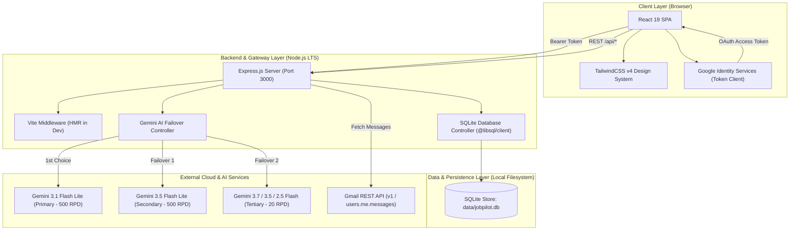

# Software Architecture & Design Document (SDD)

## 1. System Overview & Context

**JobPilot AI** is built following the **C4 software architecture model** with an emphasis on local-first data ownership, low-latency AI reasoning, and strict layout precision.



---

## 2. Core Design Decisions

### 2.1 Multi-Model AI Failover Architecture
To ensure high availability and prevent rate limit disruptions on free and standard Google AI Studio tiers, all GenAI requests pass through `callGeminiSafe(prompt, schema, taskName)`:

- **Tier 1 (High Quota Primary)**: `gemini-3.1-flash-lite` (500 Requests Per Day, 15 RPM).
- **Tier 2 (High Quota Secondary)**: `gemini-3.5-flash-lite` (500 Requests Per Day, 15 RPM).
- **Tier 3 (Fallback Pool)**: `gemini-3.7-flash`, `gemini-3.5-flash`, `gemini-2.5-flash`, `gemini-2.5-flash-lite` (20 Requests Per Day).
- **Tier 4 (Deterministic Fallback)**: If offline or all AI models return 503/429 errors, the system triggers deterministic heuristic analyzers (`calculateFallbackMatch`) grounded in the candidate's master profile, ensuring the UI never crashes.

### 2.2 Mathematical 1-Page A4 Resume Layout Budget
Standard A4 height is **297mm**. To guarantee a single-page PDF and print output with **0% chance of spilling onto page 2**, vertical heights are mathematically constrained:

$$\text{Total Height} = \text{Header} + \text{Summary} + \text{Skills} + \text{Exp} + \text{Projects} + \text{Education} + \text{Footer} \le 265\text{mm}$$

| Section | Target Height | Constraints / Curations |
| :--- | :--- | :--- |
| **Header** | 24mm | Centered bold name (15pt), target role & company (8.5pt blue), contact details & links (7.5pt). |
| **Professional Summary** | 22mm | 3-line maximum ATS summary highlighting AWS, EKS, Terraform, and TCS metrics. |
| **Technical Core Skills** | 30mm | 4 grouped rows (Cloud & Infra, Containers & CI/CD, IaC & DevSecOps, Scripting & Observability). |
| **Professional Experience** | 98mm | Current TCS role (top 4 metric bullets, line height 2.8mm) + Celebrare role (top 2 bullets). |
| **Featured Projects** | 24mm | 2 projects (Face Recognition DevOps Pipeline & Auto-WCEBleedGen) with 1-line descriptions. |
| **Education & Certifications** | 22mm | AWS SAA-C03 Credly badge + JNU B.Tech CSE (CGPA 8.57) + Notice Period & CTC. |
| **ATS Stamp & Margins** | 25mm | Top/bottom margins (11mm each) + ATS verification footer stamp pinned at 288mm. |
| **Total Height Used** | **~245mm** | **Leaves ~42mm safe margin before 287mm printable edge**. |

---

## 3. Component Hierarchy & Workspace State Flow

```mermaid
graph TD
    App["App.tsx (Root State: jobs, masterProfile, activeTab)"]
    
    App --> Navbar["Navbar.tsx"]
    App --> DashboardView["DashboardView.tsx"]
    App --> JobsExplorerView["JobsExplorerView.tsx"]
    App --> ApplicationWorkspaceView["ApplicationWorkspaceView.tsx"]
    App --> TrackerView["TrackerView.tsx"]
    App --> MasterProfileView["MasterProfileView.tsx"]
    App --> AnalyticsView["AnalyticsView.tsx"]
    
    subgraph WorkspaceSubsystem["Workspace Subsystem"]
        ApplicationWorkspaceView --> JobQueue["Job Queue Strip (Unapplied vs All Filter)"]
        ApplicationWorkspaceView --> PrevNextNav["Previous / Next Job Nav Controller"]
        ApplicationWorkspaceView --> MarkAppliedNext["Mark Applied & Next Action"]
        ApplicationWorkspaceView --> ResumeTab["1-Page Resume Preview (Printable Container)"]
        ApplicationWorkspaceView --> AutofillTab["Autofill Q&A Assistant"]
        ApplicationWorkspaceView --> EmailTab["Cold Email Generator"]
        ApplicationWorkspaceView --> InterviewTab["Interview Battlecards Prep"]
    end

    subgraph Modals["Persistent Modals"]
        App --> IngestJobModal["IngestJobModal.tsx"]
        App --> GmailSyncModal["GmailSyncModal.tsx (OAuth / Test Simulation)"]
        App --> ResumeUploadModal["ResumeUploadModal.tsx"]
        App --> BackupBinModal["BackupBinModal.tsx (7-Day Soft-Delete Bin)"]
    end
```



---

## 4. Job Queue & Dynamic Sorting Logic

The application classifies job opportunities into two operational phases:

1. **Unapplied Pipeline**: Statuses `DISCOVERED`, `ANALYZING`, `MATCHED`, `RECOMMENDED`, `RESUME_READY`, `READY_TO_APPLY`.
2. **Applied Pipeline**: Statuses `APPLIED`, `SCREENING`, `INTERVIEW`, `OFFER`, `REJECTED`.

```typescript
// Unapplied jobs sorted by match score
const unappliedJobs = allJobs
  .filter(j => !isJobApplied(j.status))
  .sort((a, b) => (b.matchAnalysis?.overallScore || 0) - (a.matchAnalysis?.overallScore || 0));

// Applied jobs automatically sorted to the bottom
const appliedJobs = allJobs
  .filter(j => isJobApplied(j.status))
  .sort((a, b) => (b.matchAnalysis?.overallScore || 0) - (a.matchAnalysis?.overallScore || 0));

// Unified active queue
const fullOrderedQueue = [...unappliedJobs, ...appliedJobs];
```

When a user clicks **"Mark Applied & Next"**:
1. The active job's status updates to `APPLIED` and persists to SQLite.
2. The job automatically drops into the lower applied partition.
3. The workspace transitions focus to the next unapplied opportunity in the queue.

---

## 5. Security & Privacy Model

1. **Local-First Data Ownership**: All candidate profiles, resumes, and opportunity pipelines are stored locally on the user's filesystem in `data/jobpilot.db`.
2. **Restricted OAuth Scopes**: Gmail integration uses Google Identity Services client-side authorization requesting exclusively `https://www.googleapis.com/auth/gmail.readonly`. The app cannot send or delete emails.
3. **Zero Secret Leakage**: API keys and client credentials reside in `.env` and are loaded via Node `process.env` on the server, never exposed in client bundles.

---

## 6. Related Documentation

- 🗄️ [Database Schema & REST API Reference](API_AND_DATABASE_SCHEMA.md)
- 🛠️ [DevOps, CI/CD & Maintenance Guide](DEVOPS_AND_MAINTENANCE_GUIDE.md)
- 🚀 [Root Project README](../README.md)

