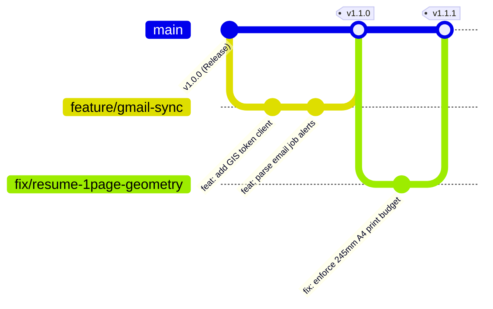

# DevOps, SRE & Maintenance Guide

## 1. Development & Engineering Standards

### 1.1 Git Branching & Workflow Model

JobPilot AI follows **Trunk-Based Development** with short-lived feature and fix branches:



#### Branch Naming Conventions
- `feature/<feature-name>`: New functionality (e.g., `feature/custom-cover-letter`).
- `fix/<issue-name>`: Bug fixes and regression repairs (e.g., `fix/oauth-origin-mismatch`).
- `perf/<scope>`: Performance optimizations (e.g., `perf/sqlite-indexing`).
- `docs/<scope>`: Documentation updates (e.g., `docs/api-schema-update`).

#### Commit Message Standard (Conventional Commits)
All commits must follow the Conventional Commits format:
```text
<type>(<optional scope>): <short imperative description>

[optional body]
[optional footer(s)]
```
- **`feat`**: A new user-facing or backend feature.
- **`fix`**: A bug fix or error correction.
- **`docs`**: Documentation only changes.
- **`style`**: Formatting, whitespace, semicolon changes with no code logic impact.
- **`refactor`**: Code restructuring without altering external behavior.
- **`perf`**: A code change that improves speed, memory, or bundle footprint.
- **`test`**: Adding or modifying automated tests.
- **`chore`**: Build system, dependencies, or toolchain configuration updates.

---

### 1.2 Quality Gates & Pre-Commit Checks

Before merging to `main` or building for production, all code must satisfy three mandatory verification checks:

```bash
# 1. Static Type Checking (Zero TypeScript compiler errors)
npx tsc --noEmit

# 2. Static Code Analysis (ESLint)
npm run lint

# 3. Production Compilation & Asset Bundling
npm run build
```

---

## 2. CI/CD Pipeline Architectures

### 2.1 GitHub Actions Workflow (`.github/workflows/ci.yml`)

The automated continuous integration pipeline runs on every push and pull request to `main`:

```yaml
name: JobPilot AI Continuous Integration

on:
  push:
    branches: [ main ]
  pull_request:
    branches: [ main ]

jobs:
  build-and-validate:
    name: Build, Lint & Typecheck
    runs-on: ubuntu-latest

    steps:
      - name: Checkout Source Code
        uses: actions/checkout@v4

      - name: Setup Node.js Environment
        uses: actions/setup-node@v4
        with:
          node-version: 20.x
          cache: 'npm'

      - name: Install Project Dependencies
        run: npm ci

      - name: TypeScript Static Type Validation
        run: npx tsc --noEmit

      - name: Execute Code Linter
        run: npm run lint

      - name: Compile Production Bundle
        run: npm run build
        env:
          NODE_ENV: production
```

---

### 2.2 Enterprise Jenkins Declarative Pipeline (`Jenkinsfile`)

For on-premise, AWS EC2, or hybrid infrastructure deployments, use the following declarative pipeline:

```groovy
pipeline {
    agent any

    environment {
        NODE_ENV = 'production'
        PORT = '3000'
    }

    stages {
        stage('Checkout') {
            steps {
                checkout scm
            }
        }

        stage('Install Dependencies') {
            steps {
                sh 'npm ci'
            }
        }

        stage('Type Check & Lint') {
            steps {
                sh 'npx tsc --noEmit'
                sh 'npm run lint'
            }
        }

        stage('Build Production Assets') {
            steps {
                sh 'npm run build'
            }
        }

        stage('Deploy / Restart Service') {
            steps {
                // Example PM2 or systemd zero-downtime reload
                sh 'pm2 restart jobpilot-ai || pm2 start dist/server.js --name jobpilot-ai'
            }
        }
    }

    post {
        always {
            cleanWs()
        }
        failure {
            echo "JobPilot AI CI/CD Pipeline build failed. Check console output."
        }
    }
}
```

---

## 3. Site Reliability Engineering (SRE) Runbooks & Incident Response

### 3.1 Runbook: Port 3000 Conflict (`EADDRINUSE`)

#### Symptom
When launching `npm run dev` or `start.bat`, the terminal displays:
```text
Error: listen EADDRINUSE: address already in use :::3000
    at Server.setupListenHandle [as _listen2] (node:net:1904:16)
```

#### Remediation

##### Windows (PowerShell):
```powershell
# Identify and terminate the process holding port 3000
Get-NetTCPConnection -LocalPort 3000 | ForEach-Object { Stop-Process -Id $_.OwningProcess -Force }
```

##### Linux / macOS:
```bash
# Locate process and terminate
fuser -k 3000/tcp
# Or using lsof:
kill -9 $(lsof -t -i:3000)
```

---

### 3.2 Runbook: Google OAuth Errors (400 & 403)

#### Symptom A: `Error 400: origin_mismatch`
- **Cause**: The browser URL (e.g. `http://localhost:3000`) is not listed in the Google Cloud Console's **Authorized JavaScript origins**.
- **Fix**:
  1. Open [Google Cloud Console Credentials](https://console.cloud.google.com/apis/credentials).
  2. Select your OAuth 2.0 Client ID.
  3. Under **Authorized JavaScript origins**, add:
     - `http://localhost:3000`
     - `http://127.0.0.1:3000`
  4. Save changes and wait 2–5 minutes for Google's edge cache to propagate.

#### Symptom B: `Error 403: access_denied` / `JobPilot-AI has not completed Google verification`
- **Cause**: The Google Cloud project's OAuth Consent Screen is set to **Publishing status: Testing**, and the user's Google account is not on the approved test users list.
- **Fix**:
  1. Open [Google Cloud Console OAuth Consent Screen](https://console.cloud.google.com/apis/credentials/consent).
  2. Scroll down to **Test users**.
  3. Click **+ ADD USERS**.
  4. Enter your email (e.g. `rs6578264@gmail.com`).
  5. Click **Save**.

---

### 3.3 Runbook: Gemini AI Rate Limits (429) & Model Spikes (503)

#### Quota & Rate Limit Matrix (Google AI Studio Free/Standard Tiers)

| Model Name | Requests Per Minute (RPM) | Requests Per Day (RPD) | Tokens Per Minute (TPM) | Recommended Role in JobPilot AI |
| :--- | :--- | :--- | :--- | :--- |
| `gemini-3.1-flash-lite` | **15 RPM** | **500 RPD** | 250,000 | **Primary Default Engine** |
| `gemini-3.5-flash-lite` | **15 RPM** | **500 RPD** | 250,000 | **Secondary Failover Engine** |
| `gemini-3.7-flash` | 5 RPM | 20 RPD | 250,000 | Tertiary Fallback Pool |
| `gemini-3.5-flash` | 5 RPM | 20 RPD | 250,000 | Tertiary Fallback Pool |
| `gemini-2.5-flash` | 5 RPM | 20 RPD | 250,000 | Tertiary Fallback Pool |
| `gemini-3.8-flash` | 5 RPM | 20 RPD | 250,000 | Deprioritized (Low 20 RPD quota) |

#### Failover Execution Logic in `server.ts`
When an AI endpoint is called, `callGeminiSafe()` sequentially tries models from highest daily quota (`gemini-3.1-flash-lite` with 500 RPD) down through the fallback tiers.

If all Gemini models are exhausted or network access is offline, the deterministic heuristic engine (`calculateFallbackMatch`) computes match scores, keyword matrices, and recruiter pitches using Rohit's master profile without failing the request.

#### Custom Model Override
To force a specific Gemini model across all tasks, specify it in `.env`:
```env
GEMINI_MODEL=gemini-3.1-flash-lite
```

---

### 3.4 Runbook: SQLite Database Maintenance & Recovery

#### Automatic Backup & Pruning
- Soft-deleted jobs are retained in `jobs_backup` for **7 days**.
- Every server boot executes `cleanupExpiredBackups()` to automatically purge expired records.

#### Manual Snapshot Backup
You can download a complete binary snapshot of the database at any time by navigating to:
```text
http://localhost:3000/api/db/download
```

#### Vacuuming Database
To defragment and optimize SQLite disk usage:
```bash
# Using sqlite3 CLI on data/jobpilot.db
sqlite3 data/jobpilot.db "VACUUM;"
```

---

## 4. DevSecOps & Security Hygiene Policy

1. **Zero Secret Leakage**:
   - `GEMINI_API_KEY` and other sensitive environment variables must only exist in local `.env` files.
   - `.env`, `.env.local`, and `data/*.db` are strictly included in `.gitignore` and must never be committed to version control.

2. **Least-Privilege OAuth Scopes**:
   - The application strictly requests `https://www.googleapis.com/auth/gmail.readonly`.
   - Write, send, and delete scopes are prohibited.

3. **Input Sanitization & Rate Limits**:
   - Express body parser enforces a `10mb` ceiling to prevent denial-of-service memory pressure from large resume payloads.
   - All AI prompt inputs are sanitized against SQL and shell injection patterns.
